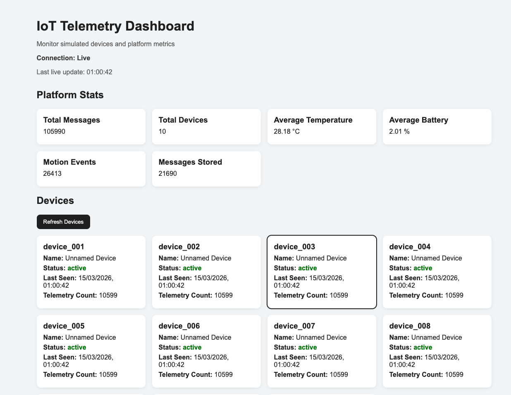
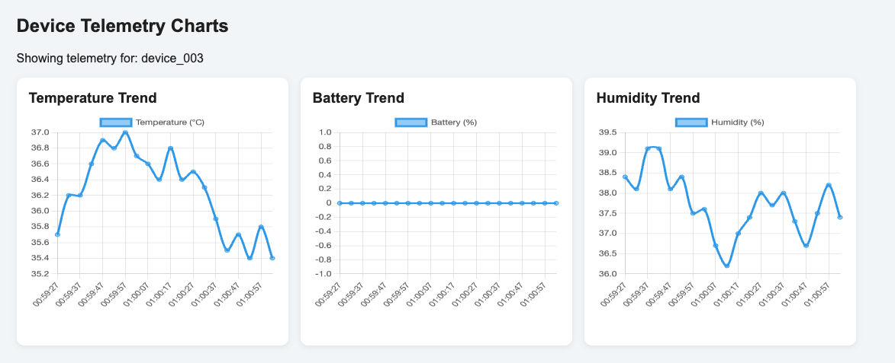
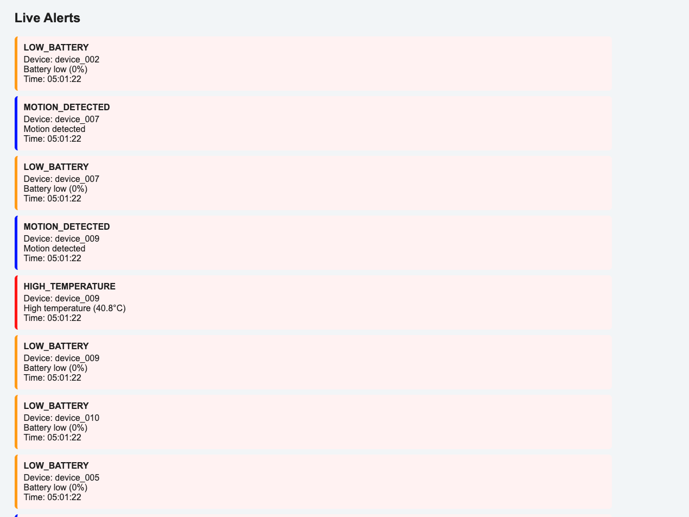

# IoT Device Simulator + Cloud Telemetry Platform

A scalable IoT telemetry platform that simulates connected devices sending real-time data to a cloud backend. The platform ingests telemetry through MQTT, stores it in PostgreSQL, exposes REST APIs, streams live updates over WebSockets, and visualizes device activity in a browser dashboard.

The system demonstrates:

- device simulation
- MQTT messaging
- real-time telemetry ingestion
- database storage
- dashboard visualization
- scalable architecture

## Features

- Simulates multiple IoT devices generating telemetry
- Publishes telemetry to an MQTT broker
- Ingests and validates telemetry in a Node.js backend
- Stores telemetry in PostgreSQL
- Exposes REST API endpoints for devices and stats
- Streams real-time telemetry and alerts over WebSockets
- Displays metrics, devices, charts, and live alerts in a dashboard
- Supports basic device registration and status management
- Runs with Docker Compose

## Architecture

Device Simulator → MQTT Broker → Ingestion Service → PostgreSQL
↓
WebSocket Server
↓
Dashboard

## Tech Stack

- Python
- Node.js
- Express
- MQTT / Mosquitto
- PostgreSQL
- WebSockets
- HTML / CSS / JavaScript
- Docker Compose

## Getting Started

### Prerequisites

- Docker
- Docker Compose

### Run the platform

```bash
docker compose up --build
```

### Access the services

- Dashboard: [http://localhost:8080](http://localhost:8080)
- API: [http://localhost:3000](http://localhost:300)

### Example API Endpoints

- `GET /stats`
- `GET /devices`
- `GET /devices/:id/telemetry`
- `POST /devices`
- `PATCH /devices/:id`
- `PATCH /devices/:id/disable`
- `PATCH /devices/:id/enable`

## Project Highlights

- Built an end-to-end telemetry pipeline using MQTT, REST, WebSockets, and PostgreSQL
- Designed a dashboard for live device monitoring and alerts
- Dockerized the full platform for reproducible local deployment
- Load-tested the simulator with increasing device counts to observe throughput and bottlenecks

## Future Improvements

- Batch database writes for better throughput
- Authentication and role-based access
- Historical analytics dashboards
- Config-driven alert rules
- Device control-plane integration for disabled devices

## Screenshots

### Dashboard Overview



### Device Telemetry Charts



### Live Alerts



## Load Testing

The platform was load-tested with progressively increasing device counts to evaluate ingestion throughout and identify bottlenecks in logging and per message database writes.

```bash
DEVICE_COUNT=50 PUBLISH_INTERVAL=5 python3 device_simulator.py
```

```bash
DEVICE_COUNT=100 PUBLISH_INTERVAL=3 python3 device_simulator.py
```

```bash
DEVICE_COUNT=500 PUBLISH_INTERVAL=2 python3 device_simulator.py
```

```bash
DEVICE_COUNT=1000 PUBLISH_INTERVAL=1 python3 device_simulator.py
```
