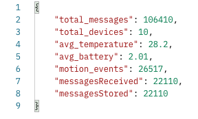

# API Documentation

## GET /stats

Returns overall platform statistics.



## GET /devices

Returns all registered devices with status, last seen, and telemetry count.

## GET /devices/:id/telemetry?limit=20

Returns recent telemetry for a specific device.

## POST /devices

Registers or updates a device.

Example body:

```json
{
  "device_id": "device_999",
  "name": "Warehouse Sensor"
}
```

## PATCH /devices/:id

Updates a device name.

## PATCH /devices/:id/disable

Disables a device.

## PATCH /devices/:id/enable

Re-enables a device.
